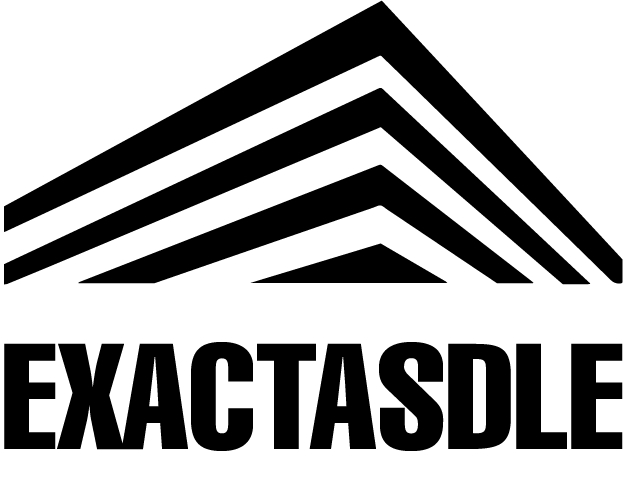

<!-- logo proyecto -->

 
  

  
 

     
      <a href="https://exactasdle.net">Official Site</a>
      <a href="https://github.com/lmendezayl/exactasdle/issues">Report Bug</a>
      <a href="https://github.com/lmendezayl/exactasdle/issues">Request Feature</a>
     

## About the project

**exactasdle** is a guessing game inspired by [Loldle](https://loldle.net), but focused on subjects from the Facultad de Ciencias Exactas y Naturales (FCEyN) at Universidad de Buenos Aires.

## Features
 Players must guess the daily subject based on attributes described below.
  - **Subject (Materia)**
  - **Department (Departamento)**: DM, DF, DC, DG, DBBE, DCAO, DEGE, DFBMC, DI, DQB, DQIAQF,  DQO
  - **Program (Carrera)**.
  - **Modality (Modalidad)**: obligatory, optional, or both
  - **Period (Periodo)**: annual, bimestrial, or quarterly-based.
  - **Level (Nivel)**: undergraduate, master's, and/or doctoral.
  - **Class Type (Clases)**: theory, practical, and/or lab lectures

Each day, the game resets and selects new attributes to challenge players with a new set of courses to guess.

## Tech Stack

The project uses the following technologies:

- React for building the user interface.
- Node.js and Python for handling requests and managing game logic.
- MySQL to store the course information and attributes.

##  Contributing
If you'd like to contribute, please fork the repository and use a feature branch. Pull requests are welcome.

## License
This project is licensed under the MIT License - see the LICENSE file for details.

## Credits
Designs for this project were created by [Valentina Curcio](https://www.behance.net/valentinacurcio1)
